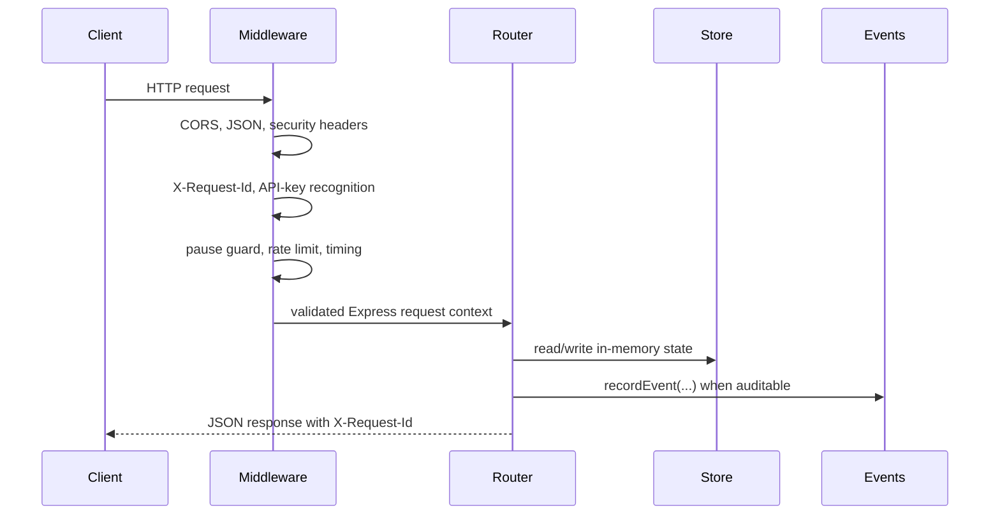
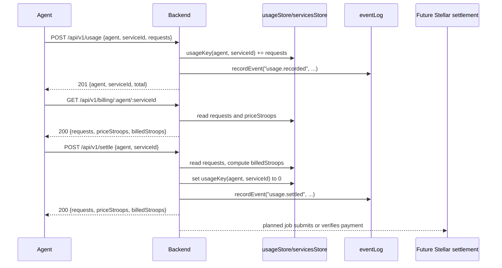

# AgentPay Backend Architecture

This backend is the off-chain metering and billing mirror for AgentPay. It
accepts usage events, keeps in-memory counters by agent and service, quotes
stroop-denominated bills, and drains counters when `POST /api/v1/settle` is
called. It does not move Stellar value by itself; on-chain settlement remains a
separate integration point.

## Composition Root

`src/index.ts` builds the Express app with `createApp()` and mounts feature
routers after the shared middleware chain:

1. `installPreRouteMiddleware(app)` installs CORS, JSON parsing, security
   headers, and request-id handling.
2. Early operational routers mount admin, config, and metrics routes.
3. `installRequestStateMiddleware(app)` recognizes known API keys, enforces the
   pause guard for writes, applies the in-process rate limiter, and records
   request timing logs.
4. Feature routers mount metadata, usage, service registry, API key, event, and
   webhook routes.
5. `installErrorHandlers(app)` normalizes terminal failures.

When the compiled entrypoint is run directly, `src/index.ts` starts the HTTP
server and installs `SIGTERM`/`SIGINT` handlers. The shutdown handler calls
`server.close()` and forces exit after a ten-second drain timeout.

## Data Model

All current state lives in process memory under `src/store/state.ts`:

- `usageStore`: maps `usageKey(agent, serviceId)` to the outstanding request
  count for that pair. `usageKey` uses the `${agent}::${serviceId}` shape.
- `servicesStore`: maps `serviceId` to service pricing metadata, currently
  `{ priceStroops }`.
- `servicesMetadata`: maps `serviceId` to optional descriptive metadata such as
  `description` and `owner`.
- `servicesDisabled`: tracks services blocked from new usage recording while
  preserving historical counters.
- `apiKeyStore`, `webhooks`, `rateBuckets`, `pauseState`, and `runtimeConfig`
  hold local operational state for adjacent features.
- `eventLog` in `src/events.ts` is a bounded audit log. The `recordEvent`
  helper appends events such as `usage.recorded`, `usage.settled`, and
  `webhook.test`.

Because these stores are in memory, a process restart clears usage counters,
service registrations, API keys, webhook registrations, rate-limit buckets, and
audit events. A durable store should replace or back these maps before this
backend is used as the source of truth for production settlement.

## Request Lifecycle

`GET`, `HEAD`, and `OPTIONS` requests continue while `pauseState.paused` is
true. State-changing requests are rejected with `503 service_paused` except for
`POST /api/v1/admin/unpause`.

## Metering and Settlement Flow

The core off-chain lifecycle is:

1. Register a service with `POST /api/v1/services`.
2. Record usage with `POST /api/v1/usage`.
3. Quote the outstanding bill with `GET /api/v1/billing/:agent/:serviceId`.
4. Drain the counter with `POST /api/v1/settle`.
5. Use a future settlement job to connect the drained quote to an on-chain
   payment or contract event.

`POST /api/v1/settle` is deliberately an accounting drain. It mirrors the
shape of an on-chain settlement calculation by multiplying outstanding requests
by `priceStroops`, but the route does not submit a Stellar transaction, escrow
funds, or prove payment. Consumers should pair settlement responses with a
contract transaction or ledger event before marking an invoice paid.

## Trust Model

The current API is open for local development and demos:

- API keys can be created and recognized, but most routes do not require a key.
- The pause guard is operational protection, not authentication.
- Request IDs support correlation and auditability, not authorization.
- CORS is allowlist-based only when `CORS_ALLOWED_ORIGINS` is configured.
- Rate limiting is in-process and IP-based, so it resets on restart and is not
  shared across replicas.

Production deployments should add durable authentication, authorization, shared
rate limiting, persistent storage, and a verified settlement worker before using
the backend as a payment control plane.

## Planned Durability and Settlement Job

The natural durability boundary is the set of maps in `src/store/state.ts` and
the bounded `eventLog` in `src/events.ts`. A future store adapter should keep the
public route contracts unchanged while persisting:

- usage counters keyed by `usageKey(agent, serviceId)`;
- registered services, disabled state, and service metadata;
- audit events emitted by `recordEvent`;
- API keys and webhook subscriptions.

A future settlement job should consume drained settlement records or audit
events, submit or verify the Stellar-side payment, then attach the transaction
result to the backend audit trail. Until that exists, the backend remains a
metering and quote service rather than an on-chain payment executor.
