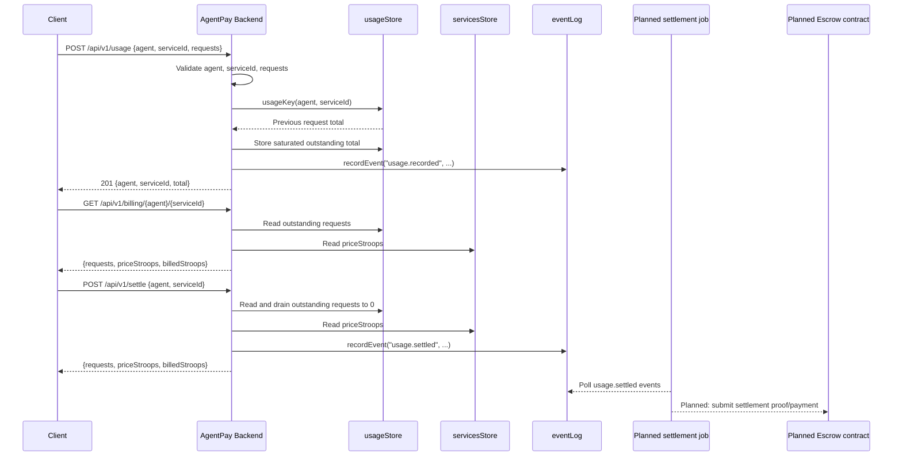

# AgentPay Backend Architecture

This document describes the current backend implementation in `src/index.ts` and the planned relationship between the off-chain metering mirror and the on-chain escrow settlement contract.

## Current Scope

AgentPay Backend is an Express API gateway for service registration, usage metering, billing quotes, settlement drains, API-key metadata, webhooks, event logs, and operator status endpoints.

The current implementation is intentionally in-memory:

- Usage accumulators live in `usageStore`.
- Services and their `priceStroops` values live in `servicesStore`.
- Service disabled flags live in `servicesDisabled`.
- API-key metadata lives in `apiKeyStore`.
- Webhook registrations live in `webhookStore`.
- Audit events live in `eventLog` and are appended through `recordEvent`.

These stores are process-local. A restart clears them, so they should be treated as a development mirror until durable storage lands.

## Data Model

### Usage Accumulator

Usage is keyed by `usageKey(agent, serviceId)`, which formats the pair as:

```text
${agent}::${serviceId}
```

That key points to the outstanding request count for one agent consuming one service. The model mirrors the shape expected by the future on-chain escrow contract, where settlement needs to know:

- which `agent` consumed the service,
- which `serviceId` was consumed,
- how many requests are outstanding,
- what `priceStroops` applies to the service,
- and how many stroops should be charged.

### Services

`servicesStore` maps each `serviceId` to:

```ts
{ priceStroops: number }
```

The billing quote path uses this price to compute:

```text
billedStroops = requests * priceStroops
```

If a service is unknown, quote and settlement paths currently use `0` as the price. That is part of the current in-memory behavior, not a settlement-contract guarantee.

### Events

`recordEvent(type, payload)` appends write-side audit entries to `eventLog`. Important event types include:

- `usage.recorded`
- `usage.settled`
- `webhook.test`

`GET /api/v1/events` and `GET /api/v1/events/summary` expose this audit stream for dashboards and future settlement workers.

## Request Lifecycle

Requests pass through the middleware chain in this order:

1. CORS allowlist handling from `CORS_ALLOWED_ORIGINS`.
2. JSON parsing with a 100 KiB body limit.
3. Minimal security headers.
4. Request correlation through `X-Request-Id`.
5. Optional API-key recognition through `X-API-Key`.
6. Pause guard for state-changing methods.
7. In-memory rate limiting outside `NODE_ENV=test`.
8. Request timing and structured logging outside `NODE_ENV=test`.
9. Route handler.
10. Structured 404 or final JSON error handler.

Current trust model: the API remains open unless later auth work adds enforcement. API-key recognition records a known key on the request, but it does not reject unkeyed requests yet. Admin endpoints are also open in the current code; production deployments should put this service behind trusted network controls until token guards land.

## Usage, Quote, And Settle Flow



`POST /api/v1/settle` is currently an off-chain drain and quote operation. It does not call Stellar or any escrow contract yet. The planned settlement job should consume durable settlement records or events, submit the corresponding on-chain transaction, and reconcile success or failure back into durable state.

## Durability And Settlement Job Extension Points

Durability should plug in behind the same logical boundaries:

- Replace `usageStore` with a durable accumulator table keyed by `agent` and `serviceId`.
- Replace `servicesStore` with durable service metadata and pricing.
- Persist `recordEvent` output so settlement workers can resume after restarts.
- Add idempotency around `POST /api/v1/settle` so repeated settlement attempts do not double-charge.
- Have the settlement job read durable `usage.settled` records rather than process-local memory.
- Record the on-chain transaction hash, submission status, failure reason, and reconciliation timestamp.

The HTTP API should keep the current route-level contract while the backing stores become durable.

## Security And Operational Notes

- No private keys or Stellar secrets are present in the current backend.
- No live network submission happens in `POST /api/v1/settle`.
- `NODE_ENV=test` disables rate limiting and structured request logs for deterministic tests.
- `CORS_ALLOWED_ORIGINS` is opt-in; an empty list means same-origin only.
- The pause guard blocks writes when paused but keeps reads available.
- Open admin and write endpoints are a known current limitation until auth and token guards land.

